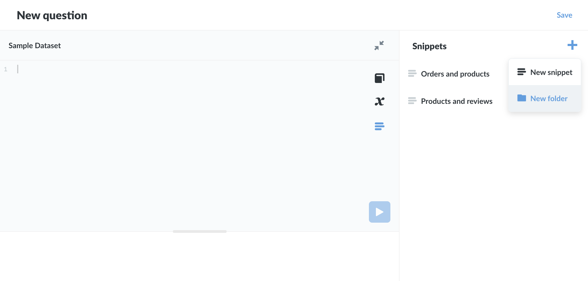
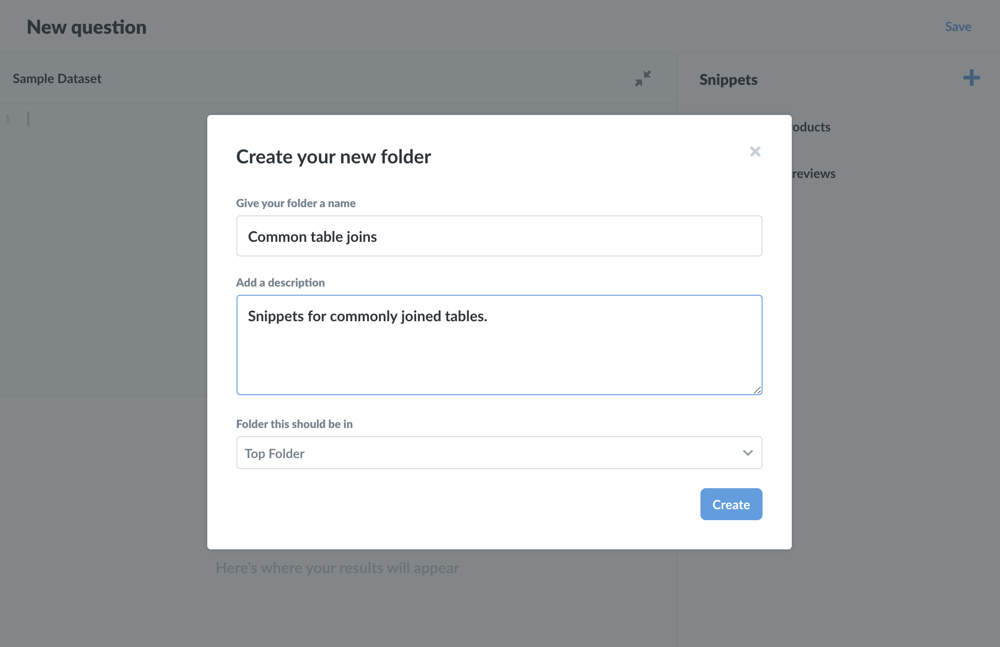

# SQL snippet folders and permissions

SQL snippet **folders** are an Enterprise feature for keeping snippets organized and setting permissions.

You can learn more about [how SQL snippets work in our User Guide](../users-guide/sql-snippets.md).

## Folders

Folders work as you would expect. You can add snippets to folders, and nest folders (i.e. create a folder, and put a subfolder in that folder, which itself has a subfolder, etc.). You can nest as many folders as your Metabase instance can handle or the laws of physics allow (whichever yields first).

### Create new SQL snippet folder

You can create a SQL snippet folder from the SQL Snippet menu in the SQL editor.

1. Click on the SQL Snippet menu icon (looks like paragraph text with three uneven horizontal lines).
2. Click on the `+` and select `New folder`
3. Give your folder a name, add a description, and place the folder (if you want to nest that folder in an existing folder.)

### Creating a new SQL snippet

When creating a SQL snippet in the Enterprise Edition, you'll also see an additional option to add that snippet to an existing folder. You can add a snippet to a folder at any time (provided you have access to those snippets).

## Permissions

Administrators can restrict access to snippets by placing snippets in **folders**, and assigning permissions to groups of people with respect to those folders. If you're familiar with [collection permissions](/docs/latest/administration-guide/06-collections.html#setting-permissions-for-collections), the functionality is similar.

### Setting permissions on a folder

Click on the ellipsis (...) next to a folder, and select **Permissions**.

There are three options for permissions:

- **Edit**. Full access to the snippet. Users can view, execute, edit, and archive or unarchive the snippet.
- **Execute**. Users in that group can view and execute that snippet, but not edit or archive/unarchive it. They can, of course, copy the snippet's code, and create a new snippet.
- **Revoke**. The snippet folder (and the snippets therein) will not show up in the SQL snippet sidebar, nor will any snippets in that folder populate snippet searches. 

SQL snippet permissions require some effort to conceptualize, as SQL snippet folders permissions work in conjunction with other sets of permissions, such as those in collections. But here's the basic rule: data is more sensitive than code, so permissions that protect data will take precedence over permissions that protect code.

For example, if users in a group have **Edit** or **Execute** permission on a snippet folder, but that group doesn't have permission to access the database queried in that snippet, they'll be able to view the snippet (and edit it, if they have edit permission), but they'll be unable to run the query and return results, as they do not have access to that database.

As a counter example, consider a question that contains a SQL snippet. If a group has 1) SQL editor access, and 2) access to that question (i.e. the group has permissions to the question via a collection), users in that group should be able to view and execute that question with the snippet, even if that group does not have permission to the snippet's folder.

Basically, you should consider SQL snippet permissions as an additional tool for snippet organization, not as method of preventing access to SQL code. Use folder permissions to keep the snippet sidebar tidy by exposing teams to folders relevant to their analytics, and restrict editing access to key snippets in your organization.
